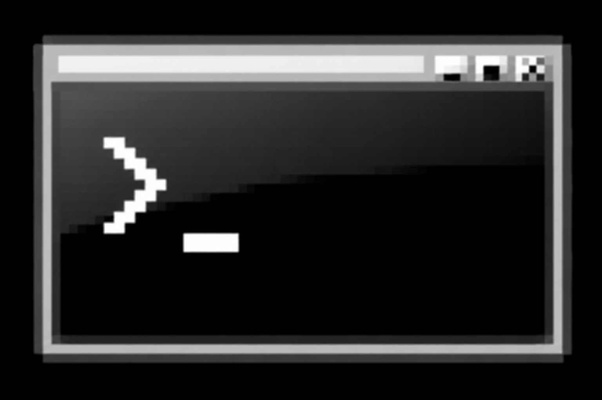

<div align="center">
  
  <h1>🌌 VORTEX</h1>
  <p><strong>The Ultimate Terminal User Interface (TUI) for Remote Server Management.</strong></p>

  <p>
    <a href="https://go.dev/"></a>
    <a href="https://github.com/charmbracelet/bubbletea"></a>
  </p>
</div>

<hr>

## 🚀 What is Vortex?

Vortex is a zero-configuration, blazing-fast VPS Manager that runs entirely inside your terminal. 

Instead of forcing you to install complex monitoring agents on your servers manually, Vortex uses an **Agentless Injection Architecture**. You simply provide your SSH credentials, and Vortex securely pushes its own compiled telemetry payload over the SSH tunnel to stream real-time data back to your dashboard.

No bloat. No background daemons. Just pure terminal speed.

## ✨ Features

- 🖥️ **Live Telemetry Dashboard**: Monitor real-time CPU, Memory, Disk, and Network traffic with beautiful ASCII graphs.
- 🐳 **Interactive Docker Manager**: View, restart, and stop your Docker containers natively from a UI table without ever typing `docker ps`.
- ⚙️ **Systemd Integration**: Browse your active Linux services (like Nginx or Postgres) and restart them instantly with a single keystroke.
- 📁 **Remote File Explorer**: An interactive, SFTP-like file browser to quickly traverse your server directories.
- 🎨 **Dynamic Theme Engine**: Swap the entire UI instantly between premium developer themes: `Catppuccin`, `Nord`, `Tokyo Night`, and `Dracula`.
- 🔑 **Native SSH Dropper**: Select a server and press `ENTER` to drop directly into a native SSH session.

## 🛠️ Installation

### Prerequisites
- [Go 1.20+](https://go.dev/dl/) installed on your machine.
- A remote Linux server with an SSH port open (or a local Docker container for testing).

### Quick Start

1. **Clone the repository:**
   ```bash
   git clone https://github.com/your-username/vortex.git
   cd vortex
   ```

2. **Run it directly:**
   ```bash
   go run ./cmd/vps-manager/main.go
   ```

3. **Or, compile it into an executable for maximum speed:**
   ```bash
   go build -o vortex.exe ./cmd/vps-manager
   ```

## 🎮 How to Use

1. **Add a Server**: Scroll to the bottom of the server list and select `[+] Add New Server`.
2. **Fill out the Details**: You can use either a Password or an SSH Key path (e.g. `~/.ssh/id_rsa`).
3. **Connect**: Select your newly added server and hit `ENTER`. Vortex will cross-compile the agent, deploy it, and load your dashboard.
4. **Navigate**: Use `TAB` and `SHIFT+TAB` to move between tabs (Dashboard, Docker, Services, Settings).
5. **Command Palette**: Press `CTRL+P` anywhere to open the global Command Palette (Coming Soon).

## 🐋 Testing Locally (Without a VPS)

If you want to test Vortex but don't have a remote server, you can instantly simulate one using Docker Desktop:

```bash
docker run -d --name vortex-test -e USER_NAME=admin -e USER_PASSWORD=password -e PASSWORD_ACCESS=true -p 2222:2222 lscr.io/linuxserver/openssh-server
```
Then, connect Vortex to:
- **Host**: `127.0.0.1`
- **Port**: `2222`
- **Username**: `admin`
- **Password**: `password`

## 🧠 Architecture

Vortex is built on a two-part architecture:
1. **The Client (TUI)**: Built with Bubble Tea and Lipgloss. It acts as the SSH controller and UI renderer.
2. **The Agent**: A lightweight Go binary (`cmd/vortex-agent`). The Client automatically cross-compiles this binary for Linux, pushes it to the server's `/tmp` directory via SSH, executes it to fetch JSON stats, and removes it.

---

<div align="center">
  <i>Built with ❤️ for terminal power users.</i>
</div>
